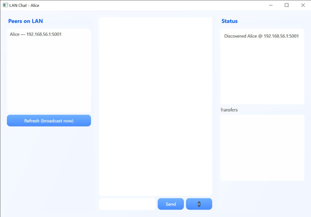
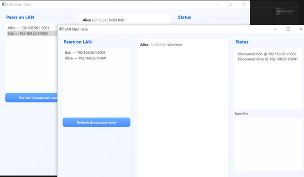

# 💬 LAN Chat + File Transfer App — Offline Peer-to-Peer Communication


---

## 📌 Overview
The **LAN Chat + File Transfer App** is a desktop-based communication system that enables **real-time chat and file sharing over a Local Area Network (LAN)** without requiring internet connectivity.  
The application uses **Python socket programming** for peer-to-peer communication and **PySide6 (Qt)** for a modern, interactive graphical user interface.

This project is designed for:
- 🏫 Academic and mini-project submissions  
- 🏢 Office or campus LAN communication  
- 💻 Understanding networking, sockets, and GUI integration  

---

## ✨ Features
✔️ Automatic peer discovery within the same LAN (UDP broadcast)  
✔️ Real-time peer-to-peer chat using TCP sockets  
✔️ Drag-and-drop file transfer support  
✔️ Multiple peers supported on the same device (different ports)  
✔️ Interactive and colorful PySide6 GUI  
✔️ Offline-first communication (no internet required)  

---

## 🛠️ Tech Stack
- **Python 3.12.5**
- **PySide6 (Qt for Python)** → GUI development  
- **Socket Programming (TCP & UDP)** → Networking  
- **Threading & Queues** → Concurrent communication handling  
- **Windows 11** (tested environment)  

---

## 🚀 Installation & Setup

### 1️⃣ Clone the repository
```bash
git clone https://github.com/Yugeshkumar31/Lanchat-Filetransfer.git
cd Lanchat-Filetransfer
```
### 2️⃣ Create & activate a virtual environment
```bash
python -m venv venv
venv\Scripts\activate
```
If script execution is blocked:
```bash
Set-ExecutionPolicy -ExecutionPolicy RemoteSigned -Scope CurrentUser
```
### 3️⃣ Install dependencies
```bash
pip install -r requirements.txt
```
### 4️⃣ Run the application
From the project root directory:
```bash
python src/main.py --name Alice --port 5001
```
Open a new terminal (same or different system on the same LAN):
```bash
python src/main.py --name Bob --port 5002
```
Peers will be automatically discovered.

---

## 🧑‍💻 How to Use

- Select a discovered peer from the list  
- Type messages and send in real time  
- Drag and drop files into the chat window to transfer  
- Received files are stored in the `received_files/` directory  

---

## 📷 Screenshots
<p align="center">
  
  <br><br>
  
  <br><br>
  
</p>

---

## 🗂️ Project Structure
```text
Lanchat-Filetransfer/
│
├── received_files/
├── src/
│   ├── app/
│   │   ├── gui.py
│   │   ├── network.py
│   │   ├── protocol.py
│   │   └── utils.py
│   ├── assets/
│   │   ├── assets.qss
│   ├── gui.py
│   ├── main.py
│   ├── network.py
│   ├── styles.qss
│   └── utils.py
├── LICENSE
├── README.md
└── requirements.txt
```
---

## 📈 Future Enhancements

- 🔐 End-to-end encryption for messages and files  
- 📊 File transfer progress bars  
- 👥 Group chat support  
- 📱 Cross-platform support (Linux/macOS)  
- 📦 Convert application into a standalone `.exe`  

---

## 🤝 Contributing

Contributions are welcome.

- Fork the repository  
- Create a new branch (`feature-new`)  
- Commit your changes  
- Open a Pull Request  

---

## 📜 License

This project is licensed under the **MIT License**.  
See the [LICENSE](LICENSE) file for details.

---

## 👨‍💻 Author

**G Yugesh Kumar**

- 📧 Email: gyugeshkumar2005@gmail.com  
- 🌐 LinkedIn: https://www.linkedin.com/in/gyugeshkumar  

